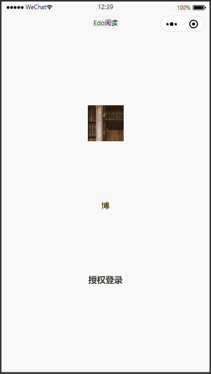
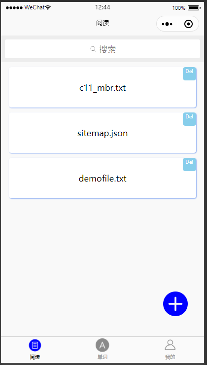

#wechat mini-program:edo reader
##file structure for this mini-program 
##**1.pages:**
**index:**
Total index of all project, the first UI 
**my:**
User personal center, contain the foreign language level & user read book record & other settings 
**readbook:**
Read UI, with the book index, click one of those books in book index to read it 
**test:**
Examine user foreign language level 
**word:**
Record the new & important & unknown words
##**2.clouds:**
Login:User login requirement, the wechat account authorize
##**3.icon:**
All icons used in this mini-program 
##mini-program usage:
**1. user login:** wechat account authorize
 

**2. add book:** if book index haven't the book you want to read, click add book button to upload it
 

**3. choose book:** choose a book to read
 

**4. annotate or train :** press button to annotate or training language model 

**train:** press button 
 

then choose a training type 
 

**annotate:** press button 
 

write down the annotate text 
 

**5. word card:** display record words 
 

**5. personal center:** display user personal info 
 
